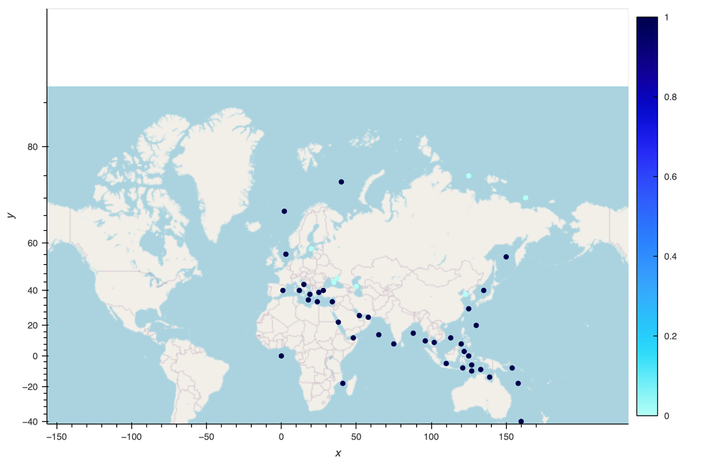
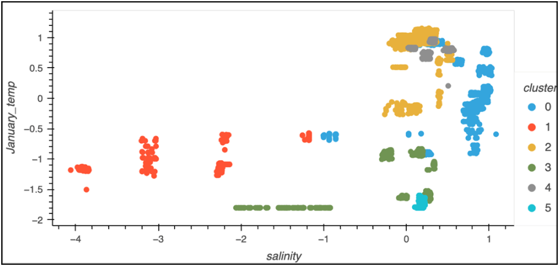
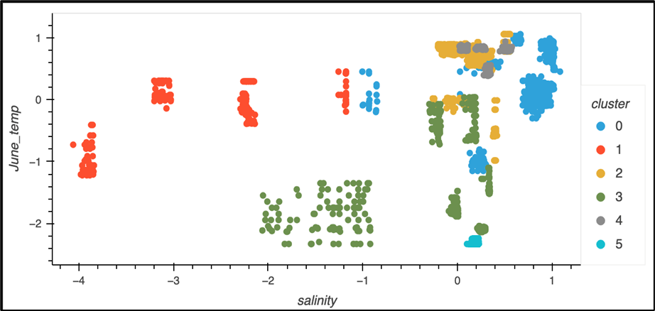
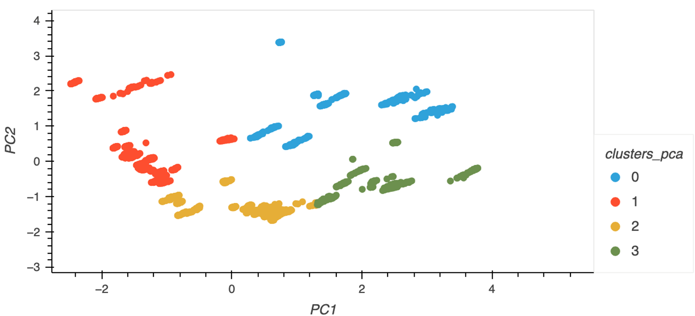
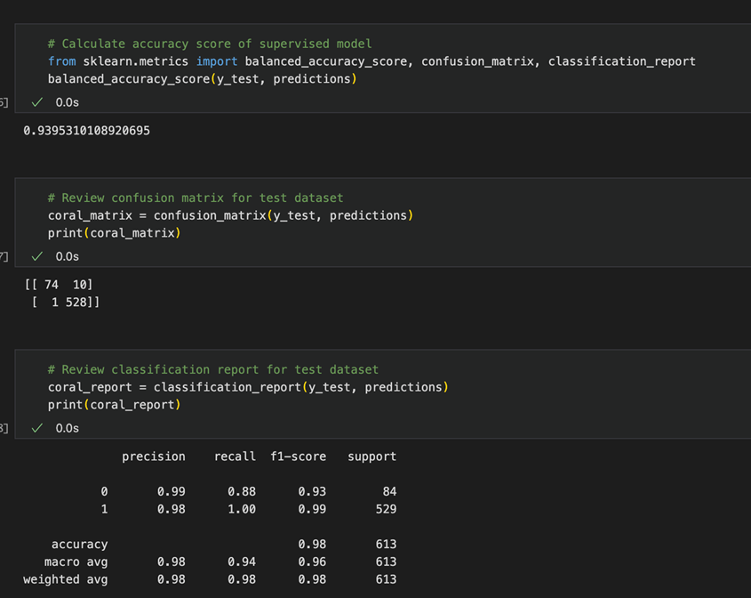

# Coral Habitat Predictor: Identifying Optimal Locations for Coral Growth

Data Source: https://www.kaggle.com/datasets/natalialimanska/corals-worldwide-distribution

## Background: What are corals and what type of aquatic environment do they prefer and thrive in? 
- "A hard substance formed in the sea from masses of shells of very small sea animals, usually orange or red in color” 
- "Coral is an animal, with plant-like cells living inside of it”
- “Some corals can naturally produce fluorescent pigments that can appear as a wide array of colors”
- Each coral polyp has stinging cells in its tentacles that are used like harpoons to spear floating plants and animals, called plankton. 
- Corals are so diverse in their shapes, sizes and colors. Mound and boulder corals grow to look like their name as enormous, round mounds on the sea floor.
- Though adult corals are attached to the ocean floor, corals in the larval, or baby, life stage can swim!
- Corals support 25% of ocean life--Coral are often referred to as a foundational or architect species, or ecosystem engineers, for constructing the physical spaces where animals live.
- Climate Change Is the Biggest Threat to Corals. Warming waters due to climate change are putting immense stress on our vulnerable coral populations.
- Corals require very saline (salty) water 

## Visualizing the Features
We first wanted to learn more about the dataset and visualize the data. We looked at high-level statistics of each column, plotted different features to see the distribution, and created a map of all the data points.

## Clusters
We then used unsupervised learning to cluster the data to identify patterns. Using the scaled original dataset, we determined the ideal number of clusters was 6. 

This plot shows the scaled salinity values to the scaled January temperature values by cluster.

This plot shows the scaled salinity values to the scaled June temperature values by cluster.

We also clustered the data using PCA methodology. We used 2 primary components and 4 clusters for the best results.

# Supervised Learning Model
Lastly, we built a supervised learning model with a logistic regression to predict the appearance of coral in certain seas. With this model, we achieved the following results.
